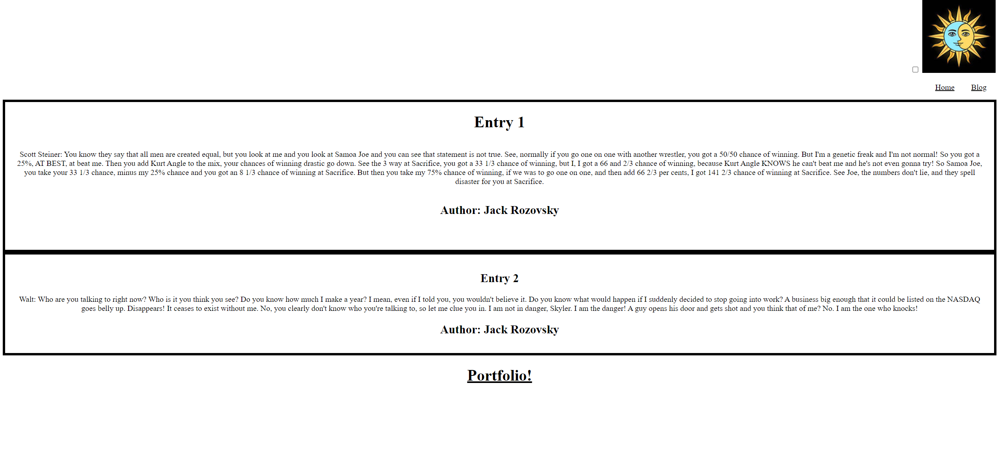

# Blog Post 
This is an html site with css and java. It contains an content section in which u can input data and it will be recored in the console, it also has a light and dark mode feature while being able to link to another html with information. it is a blog post website that contains a link to my portfolio of my work with an about me and a funny cat video highlight reel, it also includes my socials.
https://jackrozov.github.io/Blog-Post-challenge-4/

